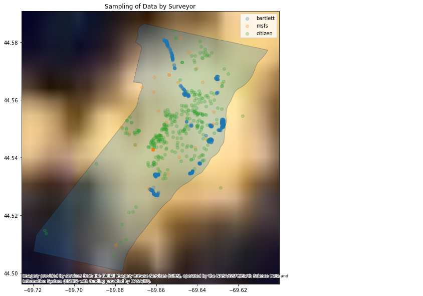
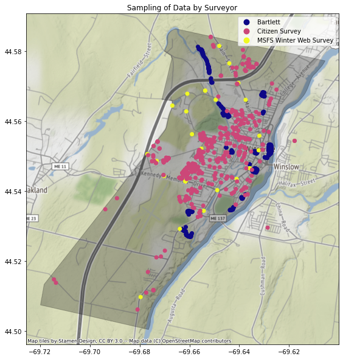
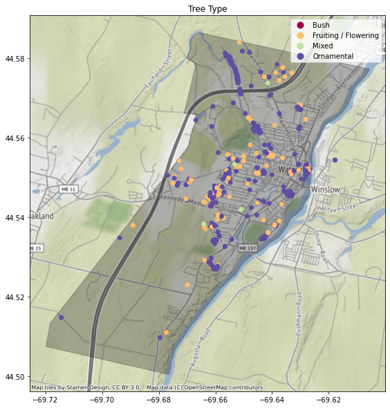
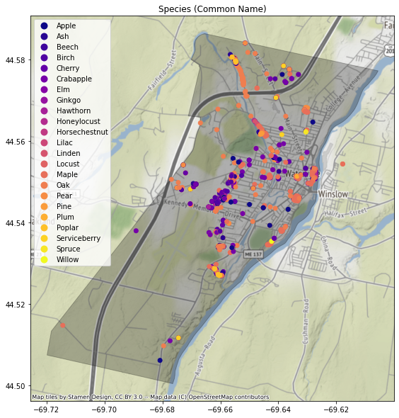

# Mapping Brown-tail Moth Population Density in the Waterville Area
### Carrie Nguyen

# Background
The Brown-tail Moth (BTM) is an invasive species to New England/Maine and poses significant environmental, economic, and human health problems. BTMs infest deciduous trees and other shrubs and harm their growth. This poses an issue for forestry and agriculture industries in Maine, which rely on these trees for income. Additionally, it can become very expensive to remove BTMs from infested areas. BTMs pose a particular danger to humans as BTM catepillars contain tiny poisonous hairs on their bodies that can cause dermatitis similar to or more extreme than poison ivy. 

Mapping BTM population is of particular concern as BTMs can only survive in more temperate environments. BTM outbreak is also associated with climate change; more mild winters can result in greater BTM outbreaks for the following year. 

I am working under the direction of Thom Klepach, a Biology professor at Colby College and City Council Member, Ward 3 for the City of Waterville. Over the past year, data on BTM sightings in the Waterville area have been collected from 3 different sources over the winter of 2021:
- A public survey conducted by Bartlett Arborists
  - 602 entries
- A private survey of citizen home BTM sightings (Google form)
  - 476 entries
- Subset of Maine State Forestry Service BTM data (Watervile area)
  - 35 entries

**Only trees with observed BTM infestation were sampled in each dataset.**

# Project Goal
**Can we map population density of BTMs and draw conclusions about their habitat in Waterville (especially as it relates to light pollution and forest density)?**

Based on the regions of BTM habitation, the city can more effectively direct extermination their extermination efforts and reduce the overall BTM population in the coming years. Correlations between BTM population density and other factors like light pollution or forest density may be possibly be used to create predictive models about future outbreaks.  

## Data Cleaning and Preparation
Implemented code that takes in the 3 separate data sets and produces a single data table across all of those, with: 
- common columns not duplicated
- missing values imputed (as appropriate)
  - Tree species/ types
  - Longitude/ Latitude data
- out-of-range values/ semantically inappropriate values flagged

# Challenges
Data Cleaning
- Major sampling differences across datasets
  - Bartlett provided counts directly
  - MSFS provided counts in a range
  - Citizen counts were binary (BTM sighted (Y/N))
 - Missing info of tree types and species

Mapping
 - Lack of high resolution light pollution and forestry maps for Waterville

Light pollution map using data from ViirsEarthAtNight Dataset

These obstacles resulted in this project being more qualitative in nature than we originally expected. 

# Results
## Maps
All maps were plotted using Geopandas. The base map for Watervile was obtained through the [Maine.gov GeoLibrary](https://www.maine.gov/geolib/catalog.html#boundaries).
### Surveyor Map

It is clear that the city of Waterville was was not sampled evenly or in the same fashion for each of the surveyors. In particular, Bartlett only sampled public lands, many which were located near bodies of water. MSFS had similar issues in sampling only trees along main roads. Citizen data had the most spread; all of these samples were from residential areas. 

### Tree Types and Species Maps
It is known that BTMs favor broadleaved trees/shrubs, especially hardwood trees (Oak, Apple, Crabapple, Pear, Birch, Cherry). 
Ornamental and Fruiting/Flowering type trees are known to be favored by BTMs. 

Maple, Oak, and Ash were the species most frequently found with BTM infestation in Waterville. 
These trees are fall into the Fruiting/Flowering or Ornamental Tree Categories, which is what we expected. 

# Future Directions
- Implement standardized set of questions for coming year of surveys
  - **Counts of BTM nests**
- Create interactive visualizations
- Obtain high quality GIS maps of Waterville area light pollution and leaf-off forest density
  - Calculate population index based on these measures
- Compare BTM density and forestry data with historical BTM and forestry data

# Reproducibility
All maps are able to be reproduced using relevant code in the repository. 
